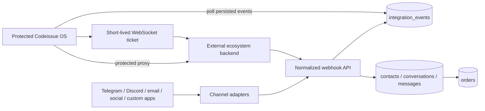

# Architecture

## System boundary

The Next.js application owns the public website, identity boundary, operator UI, normalized persistence model, and secure browser-to-backend bridge. Provider-specific OAuth, signatures, retries, media downloads, and outbound delivery should live in adapters or the external backend rather than inside UI components.

## Data model

A workspace is the tenant boundary. Users join it through `workspace_members`; integrations belong to it; all contacts, conversations, orders, and events reference it directly or through an integration.

Inbound idempotency is enforced at three levels:

1. `(source, external_event_id)` prevents processing the same delivery twice.
2. `(integration_id, external_id)` identifies a contact inside a channel.
3. `(integration_id, external_thread_id)` and `(conversation_id, external_message_id)` identify threads and messages.

Auth.js uses text user IDs while business entities use PostgreSQL UUIDs. This keeps the adapter compatible with OAuth account identifiers without weakening relational constraints in the operational model.

## Event lifecycle

1. A provider adapter verifies the provider signature and maps the payload to the normalized Codeissue envelope.
2. The adapter calls `/api/webhooks/{provider}` with the internal webhook secret.
3. The route stores the original payload in `integration_events`.
4. Message envelopes are normalized into a contact, conversation, and message in the same database transaction.
5. The admin UI reads the operational tables and the event log.
6. Asynchronous workers can claim unprocessed non-message events and update `status`, `processed_at`, or `error`.

## Backend bridge

The catch-all admin proxy is a browser-safe gateway, not a replacement for a dedicated API gateway. It applies session authorization, validates the requested path, strips browser credentials, injects trusted identity headers, applies a timeout, and returns only the backend content type.

For WebSockets, the browser first asks the same-origin application for a ticket. The application authenticates to the backend server-to-server. The ticket should be signed, scoped to the user and workspace, single-use where possible, and expire within roughly one minute.

## Production follow-up

The included implementation is a strong application foundation, but production channel delivery still requires provider-specific adapters, secret rotation, a worker queue, observability, rate limits, media storage, outbound-message state machines, audit logging, and workspace-level permission checks on every mutation. Those services can be added without replacing the current schema or admin surfaces.
