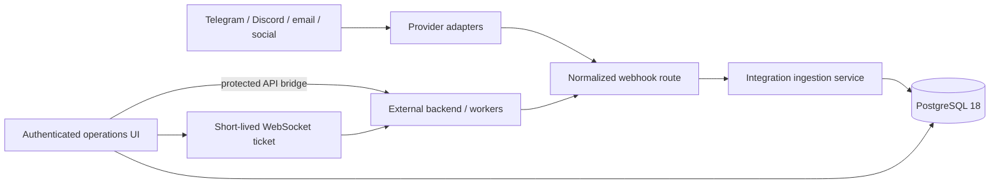

# Architecture

## Runtime boundary

The Next.js application owns the public website, Auth.js identity boundary, operator UI, normalized persistence model, and safe browser-to-backend bridge. Provider-specific OAuth, signatures, retries, media handling, and outbound delivery belong in adapters or workers.

## Code boundaries

- `app/` contains transport concerns: pages, layouts, route handlers, and server actions.
- `features/landing/` owns the public landing composition, sections, and scroll/pointer interactions.
- `lib/admin/` builds read models for the operations UI. Queries, fallback data, and DTO types are separate modules.
- `lib/workspaces/` owns tenant discovery and membership checks used by every mutation.
- `lib/integrations/` validates normalized contracts, parses webhook requests, and persists events transactionally.
- `lib/backend/` constructs validated backend URLs and trusted server-to-server headers.
- `db/` defines Drizzle schema and connectivity; `drizzle/` contains committed migrations.

Compatibility barrels remain at older import paths, but new code should import the domain module directly.

## Tenant and data model

A workspace is the tenant boundary. Users join through `workspace_members`; integrations, contacts, conversations, orders, and events all resolve to a workspace.

Inbound idempotency is enforced at three levels:

1. `(source, external_event_id)` prevents duplicate event processing.
2. `(integration_id, external_id)` identifies a contact within a provider.
3. `(integration_id, external_thread_id)` and `(conversation_id, external_message_id)` identify threads and messages.

Auth.js uses text user IDs, while operational entities use PostgreSQL UUIDs.

## Message lifecycle

1. An adapter validates the provider signature and maps the payload to the Codeissue envelope.
2. It calls `POST /api/webhooks/{provider}` with the internal webhook secret.
3. The route validates transport details and delegates to `lib/integrations/ingest.ts`.
4. The service records the raw event and upserts integration, contact, conversation, and message in one transaction.
5. The admin UI reads normalized tables and the append-only event log.
6. Workers can process outbound or non-message events and update their status.

## Backend bridge

The admin catch-all route validates the requested path, discards browser credentials, injects trusted user identity, applies a timeout, and forwards only a small set of headers. WebSocket connections use a short-lived ticket requested server-to-server; permanent backend credentials never reach browser JavaScript.

## Testing strategy

All executable tests are TypeScript or TSX. `tests/index.ts` imports the suites and is executed with Node's test runner plus the `tsx` loader. Pure validation and security helpers are tested directly; source-level architecture checks guard framework wiring and module boundaries without requiring a live database.

Production readiness still requires provider adapters, worker queues, observability, rate limiting, secret rotation, media storage, audit logging, and workspace-aware authorization on every new endpoint.
