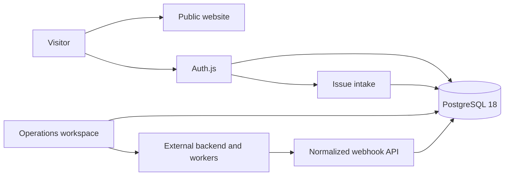

# Architecture

## Application package

The repository contains one deployable application package named `@codeissue/website`. Its internal boundaries are designed so the package can later move to `apps/website` without rewriting package-local imports.

```text
app/          Next.js routes, layouts, route handlers, compatibility action exports
features/     Product features and their public entrypoints
components/   Shared UI, forms, layout elements, icons, compatibility exports
lib/          Domain services, configuration, localization, and data access
 db/          Drizzle schema and PostgreSQL client
 drizzle/     Committed database migrations
 tests/       TypeScript and TSX tests
 scripts/     Package-local quality and maintenance scripts
```

## Dependency direction

The intended dependency direction is:

```text
app -> features -> components/lib -> db
```

`features`, `components`, `lib`, and `db` must never import from `app`. `npm run boundaries:check` enforces that rule. Route pages should import feature public entrypoints such as `@/features/auth` or `@/features/admin/inbox` instead of reaching into internal component files.

## Feature boundaries

- `features/landing` owns the public product website and browser interactions.
- `features/auth` owns login, registration, authentication forms, and auth actions.
- `features/issues` owns public issue intake and its validation-facing UI.
- `features/admin/shell` owns the workspace frame.
- `features/admin/overview` owns overview composition.
- `features/admin/inbox` owns conversations and replies.
- `features/admin/orders` owns order views and creation.
- `features/admin/integrations` owns connected channel status.
- `features/admin/events` owns persisted events and WebSocket monitoring.

Each feature exposes a small `index.ts` public API. Internal files can change without forcing route-level import churn.

## Route composition

Pages and layouts are server components by default. They authenticate, load localized copy and data, then compose one feature screen. Browser state is isolated in explicit client components such as forms, the locale select, navigation controls, and the live event hook.

## Runtime flow



## Data and tenancy

A workspace is the tenant boundary. Membership is checked before mutations. Integrations, contacts, conversations, messages, orders, and events all resolve to a workspace. Database uniqueness constraints protect external message ingestion from duplicate provider events.

## Backend bridge

The admin bridge validates backend paths, removes browser credentials, adds trusted user identity, and forwards requests with server-only credentials. WebSocket connections use short-lived tickets so long-lived backend secrets never enter browser JavaScript.
