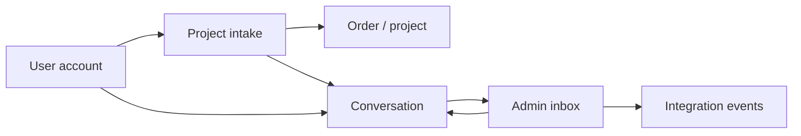

# Architecture

## Application package

The repository contains one deployable package named `@codeissue/website`. Its boundaries allow the package to move to `apps/website` later without rewriting package-local imports.

```text
app/          Next.js routes, layouts, route handlers, compatibility exports
features/     Product features and their public entrypoints
components/   Shared UI, forms, layout elements, icons
lib/          Domain services, branding, localization, and data access
 db/          Drizzle schema and PostgreSQL client
 drizzle/     Committed database migrations
 locales/     Canonical runtime translation resources
 tests/       TypeScript and TSX tests
 scripts/     Package-local quality and maintenance tools
```

## Dependency direction

```text
app -> features -> components/lib -> db
```

`features`, `components`, `lib`, and `db` must not import from `app`. `npm run boundaries:check` enforces this rule. Routes import feature public entrypoints instead of internal component files.

## Feature boundaries

- `features/landing` owns the public website and restrained browser motion.
- `features/auth` owns username/password login and registration.
- `features/issues` owns project intake.
- `features/dashboard` owns the personal workspace, project list, and project discussions.
- `features/admin/*` owns privileged operations, inbox, orders, integrations, and event monitoring.

The personal workspace and the admin console are separate products. Every account can use `/dashboard`. Only a user whose `users.role` is `admin` can enter `/admin` or call administrative APIs.

## Authentication and authorization

Auth.js uses a credentials provider and JWT sessions. The canonical account roles are:

```text
user   personal workspace and own projects
admin  personal workspace plus administrative operations
```

Authorization is enforced at server layouts, server actions, and API routes. UI visibility is not treated as a security boundary.

## Project conversation flow



The website sends project and message commands to the backend pool. The backend creates the order, conversation, initial message, and integration event in one PostgreSQL transaction. User and administrator messages share the same conversation record. Personal-workspace reads are served by the backend and always filter projects by `requestedById`.

## Tenant boundary

A workspace remains the data tenancy boundary. Membership is checked before mutations. Integrations, contacts, conversations, messages, orders, and events all resolve to a workspace. Database uniqueness constraints protect external ingestion from duplicate provider events.

## Brand and localization boundaries

Brand constants live in `lib/brand/config.ts`. Display names, canonical URLs, workspace identity, and core routes must not be duplicated in feature components.

Runtime translations live only in `locales/`. Historical translation paths are retained as deprecation markers because package snapshots preserve input files, but application code must not import them.

## Backend bridge

The server-side backend client and optional admin proxy remove browser credentials, add trusted Auth.js identity, and authenticate with the server-only website token. WebSocket connections use short-lived tickets so persistent backend secrets never enter browser JavaScript.

The sibling `@codeissue/backend` owns the operational order/message pool. Its framework-independent core runs behind either the NestJS Node adapter or the Cloudflare Worker adapter. Both validate the source-specific service token, re-check website identities and workspace membership in PostgreSQL, and scope every operation to the configured workspace.

The website owns Auth.js accounts and UI. The backend owns operational migrations and is the only runtime allowed to mutate orders, conversations, messages, integrations, and integration events. The website keeps a mirrored Drizzle schema for Auth.js and tooling but delegates migration application to the backend.

Telegram is a separate trusted source. It can ingest orders and messages with its own token, claim admin replies through an atomically leased outbox, and acknowledge delivery with the current lease token. This keeps multiple bot replicas from sending the same reply concurrently.

Realtime delivery is derived only from committed events. Node uses a one-time in-memory ticket and native WebSocket server. Cloudflare uses an HMAC-signed ticket and a workspace Durable Object for nonce consumption and fan-out. PostgreSQL remains the source of truth in both runtimes; the Durable Object does not own domain state.
